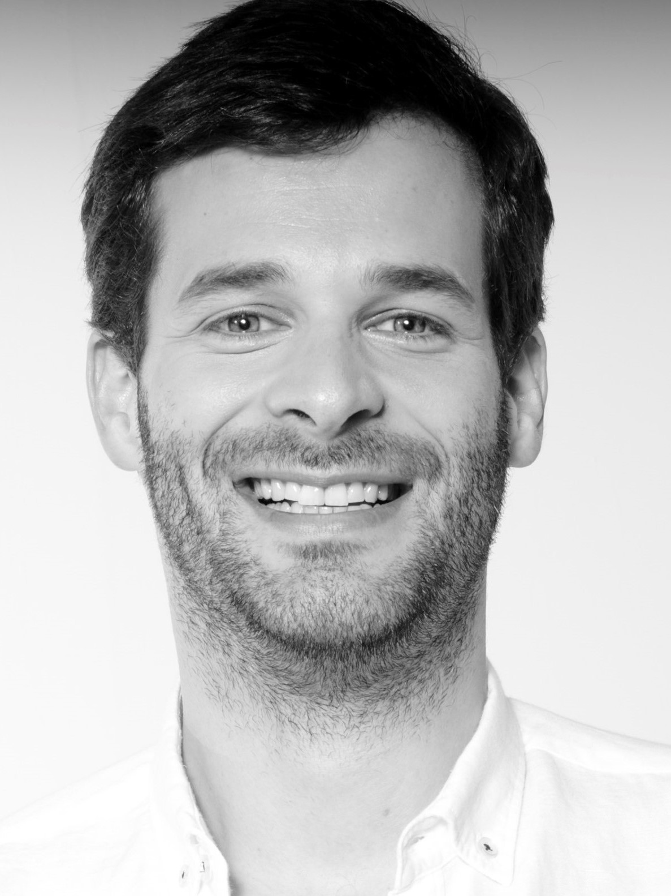

<head>
  <link rel="stylesheet" type="text/css" href="style-ref.css">
</head>

# Gonçalo Videira
📞 +351 917 830 606 / 📧 [goncalovideira@hotmail.com](mailto:goncalovideira@hotmail.com) 
📪 Lisbon, Portugal /   [LinkedIn profile](https://www.linkedin.com/in/goncalovideira/)

  

> this is still a work in progress, information is not up to date

## Executive Summary

I am a highly motivated and experienced leader with a strong commercial and entrepreneurial background. I have worked in the FMCG, Tech, Health & Wellness and Retail industries and developed a wide range of experience from working in global, regional and local assignments always with a focus in developing new business. Currently, I am setting up MC Sonae's Vertical Integration Business Unit area where I will be assessing, developing and implementing production projects to improve the value proposition we offer our clients. 
I have a growth mindset and am always looking for opportunities to learn new skills both at a professional and personal level. What I love the most about my job is that it allows me to learn from the people I work with and teams I lead, while at the same time allowing me to share my experience and improve the performance of the businesses I work with. 
Married and a father of two girls, I am lucky to be able to share my time between work, family and hobbies. We love to travel together and see novel places and I am an avid kitesurfer. 

## Working Experience

#### MC Sonae / Vertical Integration Director
📅 Jul 2022 – Present (7 months) / Lisbon, Portugal

Leading a team at MC Sonae's new Vertical Integration area:
*	Assessing more than 15 investment opportunities and developing projects in the fish and in the fruits categories;
*	Secured financing and implementing an Aquaculture project that represents more than 18 million euros in investment. 

#### MC Sonae / Wells / Weight Loss and Aesthetics Director
📅 Apr 2021 – Jun 2022 (1 year 3 months) / Lisbon, Portugal

Leading a multi-functional team that drove the growth of Wells’ services businesses: 
*	Wells’ Weight Loss business YES!diet: lead the turnaround of a business that was highly impacted by the pandemic’s lockdown; made portfolio and team changes to increase profitability and launched a new communication campaign and website to help bring this 2 million euro business back to growth; earned the “Prémio 5 Estrelas” for outstanding consumer satisfaction and the “Escolha do Consumidor” prizes;
*	Well’s Aesthetics center: internalized the operation of 14 aesthetics centers (purchased from partner) and ensured a positive profitability in year 1.

#### MC Sonae / Wells / New Business Development Manager
📅 Mar 2017 – Mar 2021 (4 years) / Lisbon, Portugal

* Launched Wells’ new weight loss program under the YES!diet brand, contributing to ~5% of store turnover in more than 40 stores.
* Led the implementation of Plano de Saúde Wells’ health plan, achieving a base of ~100k clients, and led the negotiations for the launch of an insurance.

## Projects

* project 1
* project 2

## Education & Qualifications

* Insead / MBA (class of 2013)
  - Awarded full scholarship through merit-based Primus Interpares prize (1st place)
* Católica Lisbon School of Business and Economics / Master of Science in Business (class of 2010)
  - Major in Strategy & Entrepreneurship 
  - Teaching Assistant of Mathematics during the curricular part of the Master
  - Dissertation: The challenge of corporate social responsibility in container shipping: The case of MSC Portugal, S.A. 
  - Awarded full scholarship through merit based Católica Top + program
* Católica Lisbon School of Business and Economics / Bachelor of Science in Business Administration (class of 2008)
  - Tilburg University / ERASMUS exchange program, The Netherlands (2007)
  - Awarded full scholarship through merit based Católica Top + program
* Técnico Lisboa / Biomedical Engineering (no degree awarded, 2002-05)

## Misc. Information

* Languages: Portuguese (Native), English (Fluent), Spanish (Fluent), French (Practical)
* Hobbies: 
  - Tutoring math and chemistry from 2002 to 2007 to Portuguese pupils
  - Volunteering from 2005 to 2012 with CISV International in Portugal / Germany / Spain / Mexico / Switzerland
  - Kitesurfing since 2017 and sailing since 2022
  - Programming Python and Power Apps since 2020
* Availability: 2 months' notice
